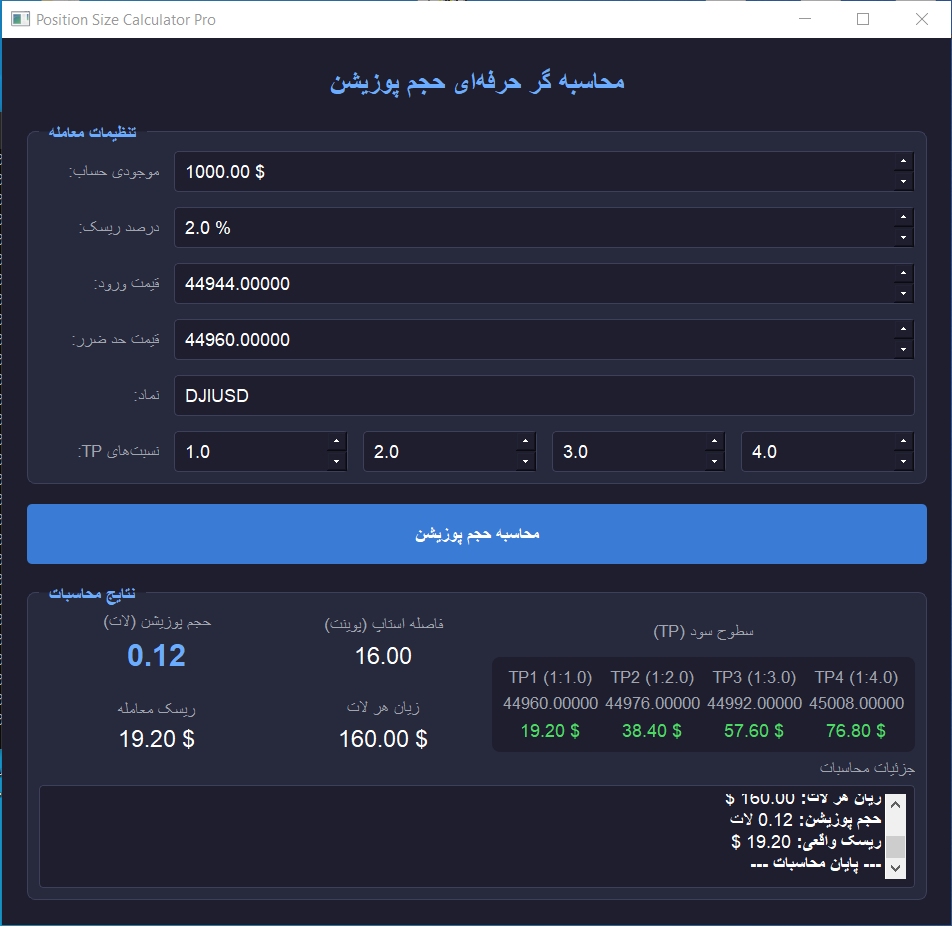

# Position Size Calculator for Dow Jones Index



This is a professional position size calculator application designed specifically for trading the Dow Jones Industrial Average (DJIA) index on MetaTrader 5. The application calculates optimal position size based on your account balance, risk tolerance, and stop loss parameters, with advanced take profit (TP) level calculations.

## Key Features

- **Precise position size calculation** based on risk parameters
- **Advanced TP calculation** with customizable risk-reward ratios
- **Broker constraints validation** (min/max lots, step size)
- **Professional dark-themed GUI** with intuitive controls
- **Detailed trade report** with all calculation parameters
- **Symbol auto-activation** for MT5
- **Real-time risk analysis** in USD

## Important Note

This application is **specifically optimized for the Dow Jones Industrial Average index**. The default symbol is set to `DJIUSD`, but depending on your broker, you might need to use one of these alternatives:

- `US30` (Common in many brokers)
- `US30Cash`
- `DJI`
- `DJIA`
- `WallStreet`

Before using the application, verify the correct symbol name with your broker.

## Prerequisites

- Python 3.7+
- MetaTrader 5 installed on your system
- Active MT5 account with access to Dow Jones symbols

## Installation

1. **Clone the repository**:
   ```bash
   git clone https://github.com/yourusername/position-size-calculator.git
   cd position-size-calculator
   ```

2. **Install required packages**:
   ```bash
   pip install -r requirements.txt
   ```

   Or install manually:
   ```bash
   pip install PyQt5 MetaTrader5
   ```

## Usage

1. Launch the application:
   ```bash
   python position_calculator.py
   ```

2. Configure your trade settings:
   - **Account Balance**: Your account balance in USD
   - **Risk Percentage**: Percentage of account to risk (1-5% recommended)
   - **Entry Price**: Your planned entry price
   - **Stop Loss Price**: Price where you'll exit if trade moves against you
   - **Symbol**: Dow Jones symbol (default: DJIUSD)
   - **TP Ratios**: Risk-reward ratios for TP levels (default: 1:1, 1:2, 1:3, 1:4)

3. Click "Calculate Position Size" to compute:
   - Optimal position size in lots
   - Dollar risk amount
   - Stop distance in points
   - Loss per lot
   - TP prices and profit amounts

## Customization

To trade other instruments, modify the following in the code:

1. Symbol configuration:
   ```python
   # Change the default symbol
   self.symbol_edit = QLineEdit("US30")  # For example
   ```

2. Instrument-specific parameters (if needed):
   ```python
   # Adjust for instruments with different pip values
   # tick_size = symbol_info.trade_tick_size
   # tick_value = symbol_info.trade_tick_value
   ```

## Screenshot


## Troubleshooting

1. **Connection Errors**:
   - Ensure MetaTrader 5 is installed and running
   - Verify your MT5 account has permission to access symbol data

2. **Symbol Not Found**:
   - Confirm the correct symbol name with your broker
   - Check if the symbol is available in your MT5 platform
   - Ensure your account has permissions to trade the symbol

3. **Calculation Issues**:
   - Verify entry and stop loss prices are correctly entered
   - Ensure positive risk percentage (1-100%)

## License

This project is licensed under the MIT License - see the [LICENSE](LICENSE) file for details.

## Disclaimer

This software is for educational purposes only. The authors are not responsible for any trading losses incurred while using this application. Always verify calculations before executing trades.
